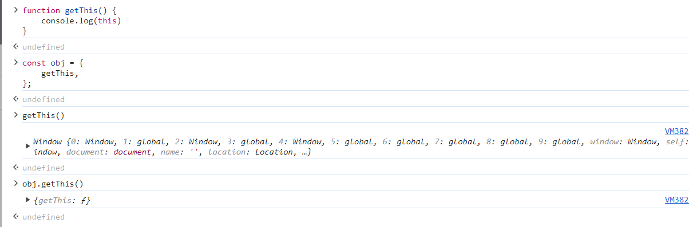
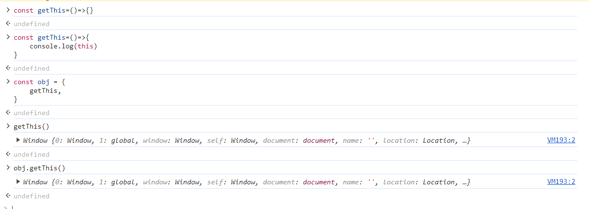
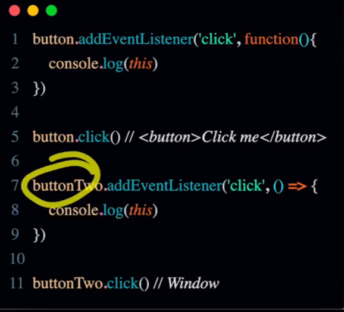

## JavaScript

- JS is single threaded language
- Its a Async & Non Blocking Behaviour by event looping

### Event Loop

- In JavaScript, the event loop is a crucial mechanism for managing asynchronous operations and handling events.
- It allows the execution of non-blocking code, making it possible to handle multiple tasks efficiently without blocking the main thread.
- The event loop model in JavaScript works as follows:

  1. Event Queue: When asynchronous events occur, such as user interactions (e.g., click events, keyboard input), HTTP responses, timers, or other asynchronous operations, they are placed into an event queue.

  2. Call Stack: — The call stack is a data structure that keeps track of the currently executing code. It maintains a record of function calls and their respective contexts (local variables, parameters).

  3. Event Loop: — The event loop continuously monitors the call stack and the event queue. When the call stack is empty (i.e., no code is executing), the event loop takes the first event from the event queue and pushes its corresponding callback function onto the call stack. This process is known as “popping an event off the queue.”

  4. Execution of Callbacks: — The callback function from the event queue is executed. If the callback itself contains asynchronous code (e.g., an asynchronous API call, a setTimeout), it’s scheduled to run later, and the event loop continues to process other events.

  5. Non-blocking Behavior: — The event loop ensures that asynchronous operations do not block the main thread, allowing other events to be processed concurrently.

  6. Completion: - The event loop keeps running as long as there are events in the queue or pending callbacks. When the queue is empty, the event loop will eventually terminate.

  ```js
  console.log('Start');
  setTimeout(() => {
  console.log('Timeout callback');
  }, 2000);
  console.log('End');

  // In this example, the output will be:
  Start
  End
  Timeout callback
  ```

### Hosting and Temporal Dead Zone

JS Engine scan all the code (Prepare memory, not execution)

- function: do the function refrence
- let,const: Make the value as uninitialized
- var: Make the value as undefined
  - Case1: Access fn before declaration -> No Issue
  - Case2: Access var before declaration -> undefined
  - Case3: Access let/const before declaration -> Reference Error (for variable, object ,etc)

Temporal Dead Zone

- Zone before actual declaration and between useages

### Scope & Scope Chain

Scope determines the accessibility of variables (objects and functions) from different parts of the code.\
3 Types are:

- Global Scope (Window, Global)
- Local Scope
- Block Scope {} (Function Scope)

Scope Chain

- The scope chain is how Javascript looks for variables.
- When looking for variables through the nested scope, the inner scope first looks at its own scope.
- If the variable is not assigned locally, which is inside the inner function or block scope, then JavaScript will look at the outer scope of said function or block to find the variable.
- If Javascript could not find the variable in any of the outer scopes on the chain, it will throw a reference error.
- Will alway go from insider to outer side, not from outside to inner side.

### Prototypal Inheritance & Chaining

- The linking of prototypes of a parent object to a child object to share and utilize the properties of a parent class using a child class.
- Prototypes are hidden objects that are used to share the properties and methods of a parent class with child classes.
  - Single Inheritance : `__proto__` can inherit only one class.
  - Multiple Inheritance : `__proto__.__proto__` (We can also called as protoypal chaining)
- 3 Types - `Object.create()` : The `Object.create()` method creates a new object and allows you to specify an object that will be used as the new object's prototype.

  ```js
  const personPrototype = {
    greet() {
      console.log("hello!");
    },
  };
  const carl = Object.create(personPrototype);
  carl.greet(); // hello!
  // OR with extra object properties of new object
  let engineerTwo = Object.create(faang, {
    empId: { value: 2 },
  });

  // assign
  const personPrototype = {
    greet() {
      console.log(`hello, my name is ${this.name}!`);
    },
  };
  function Person(name) {
    this.name = name;
  }

  Object.assign(Person.prototype, personPrototype);
  // Person.prototype.greet = personPrototype.greet;
  ```
- Object.getPrototypeOf() 
    - The property of an object that points to its prototype is not called `prototype`. 
    - The standard way to access an object's prototype is the `Object.getPrototypeOf()` method.
    
- Object.setPrototypeOf()
    - The `Object.setPrototypeOf()` static method sets the prototype (i.e., the internal `[[Prototype]]` property) of a specified object to another object or null.
    ```js
    const obj = {};
    const parent = { foo: 'bar' };
    console.log(obj.foo);
    // Expected output: undefined
    Object.setPrototypeOf(obj, parent);
    console.log(obj.foo);
    // Expected output: "bar"
    ```

Prototypal Chaining
- Protpype inside another prototype (Multiple Inheritance of protoype)

Property Shadowing
- First it will look into outer object, if not found then to its prototype, if its found with same name the outer will return the data and will not go inside prototype.
- It will avoid all prototype (inside other protoype)
```js
const myDate = new Date(1998, 12, 11); // (11th Dec)
console.log(myDate.getYear()); // 98
myDate.getYear = function () {
  console.log("something else!");
};
myDate.getYear(); // 'something else!'

```
Monkey patching
- Monkey patching is a technique to add, modify, or suppress the default behavior of a piece of code at runtime without changing its original source code.
- This is not a good practise
```js
var log = console.log;
console.log = function() {
   // Invoke the original method with an additional parameter
   log.apply(console, [(new Date()).toString()].concat(arguments));
};

console.log("Hello World!")
// Mon Jun 03 2024 22:59:26 GMT+0530 (India Standard Time) [Arguments] { '0': 'Hello World!' }

```
### Promise and Queue
- Its a Placeholder that can resole or reject in future.
- Promise is an object that will produce a single value some time in the future. 
- It have two majaor thing
    1. state/status => Default value is pending
    2. Result/value => Default value  is undefined
    - We cannot access these above object.
- `new Promise((res,rej)=>res("result"))` // `new Promise((res,rej)=>rej("result"))` these operation will be synchronize after `.then / .catch` will be asynchronize
- We can use many time `.then` (first result value will be next input `.then(res => res + 1).then(res=>res+10)`)

Notes
1. Micro Task -> `Promise handler (not promise) ie. then(), catch(), finally()` `queue Microtask()` Mutation Observer
2. Task (Macro Task) ->  `setTimtout, setInterval, setImmedidate, I/O operation, UI Rendering, HTTP request(core , not promises)`
- Microtask can return the microtask 
- If callstack and microtask is empty then execute the task(macro task) queue
```JS
console.log('Start')

setTimeout(()=>{
    console.log('Timeout!');
},0)

Promise.resolve('PromIse!')
.then(res => console.log(res));
console.log('End')
// tart
// End
// Promkse!
// Timeout!
```

### Async Await
- `Promise.resolve('chai')`
- `async function tea(){ return 'chai' }`
- Both the code is equivalent (no need for await return in 2nd code, we can use for quivalent to .then)

1. `await` can suspend asynchronus function while we wait for awaited value return a resolved promise
2. `after await` rest of the async function gets run in micro task 

Example 1
```js
const one=()=>Promise.resolve("One");

async function test(){
    console.log("Inside test function");
    const result = await one();
    console.log(result);
}
console.log("Before calling test function");
test();
console.log("After calling test function");
// Before calling test function
// Inside test function
// After calling test function
// One
```

Example 2
```js
console.log("Script start"); // Synchronous code

setTimeout(function(){
    console.log("setTimeout"); // Macro task
},0);

new Promise((resolve, reject)=>{
    console.log("Promise constructor") // Synchronous code inside Promise constructor
    resolve("Promise resolved")
}).then(function(res){
    console.log(res) // Micro task
})

async function asynFunc(){
    console.log("asyncFunc start") // Synchronous part of the async function
    await new Promise((resolve)=>{
        console.log("Promise inside asyncFunc");
        resolve("async/await resolved");
    })
    console.log("asyncFunc end") // This line is treated as micro task due to await
}
asynFunc();
console.log("Script end") // Synchronous code
// Script start
// Promise constructor
// asyncFunc start
// Promise inside asyncFunc
// Script end
// Promise resolved
// asyncFunc end
// setTimeout
```

### Closure and lexical scoping
- A closure is the combination of a function bundled together (enclosed) with references to its surrounding state (the lexical environment). 
- In other words, a closure gives you access to an outer function's scope from an inner function. 
- In JavaScript, closures are created every time a function is created, at function creation time.
    - Inner lexical enviroment refers to outer lexical enviormnet.
    - When outer L.E is not refernece, it is garbage collected.

```js
const getValue = ()=>{
    let score = 10;
    return () => ++score;
}

const value = getValue(); // const value have a function reference not a value
console.log(value()) // 11
console.log(value()) // 12
```
```js
const getValue = ()=>{
    let score = 10;
    return () => score++;
}

const value = getValue(); // const value have a function reference not a value
console.log(value()) // 10
console.log(value()) // 11
```
```js
function loadBalance(){
    let userBalance = 100;

    function addBalance(){
        let newValue = ++userBalance;
        return newValue;
    }

    return {addBalance};
}

console.log(loadBalance().addBalance()) // 
const balance = loadBalance();
console.log(balance.addBalance())
console.log(balance.addBalance())
// 101
// 101
// 102
```

### This 
- Window in Browser, Global in Runtime
- “This” keyword refers to an object that is executing the current piece of code.
- It references the object that is executing the current function.
- If the function being referenced is a regular function, “this” references the global object.
- Normal function
    
- Arrow function
    
    

### Call, Apply, Bind
- In JavaScript, the call, apply, and bind methods are used to call a function and set the “this” value inside that function.
- Call: Immediately invoked function with specified `this`
- Apply: same as call but args are passed as an `Array`
- Bind : Return a `new function`, when called has its `this` value set to provided value


Call
- The call method is used to call a function and specify the “this” value for the function.
- It takes two arguments: the value to be used as the “this” value inside the function, and an optional list of arguments to be passed to the function.

Apply
- The apply method is similar to the call method, but instead of specifying the arguments to the function individually, it takes an array of arguments to be passed to the function.

Bind
- The bind method is used to create a new function with the same body as the original function, but with a different “this” value. 
-  It also takes an optional list of arguments to be passed to the new function when it is called.